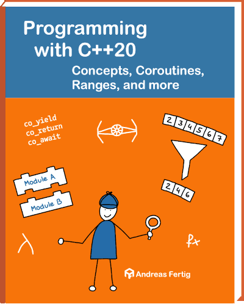

# Companion Source Code for "Programming with C++20 - Concepts, Coroutines, Ranges, and more" 2. Edition

[](https://github.com/andreasfertig/programming-with-cpp20/actions/) [](/LICENSE.txt)



## Code examples

This repository contains runnable source code examples from the 2. edition of [Programming with C++20 - Concepts, Coroutines, Ranges, and more](https://andreasfertig.com/books/programming-with-cpp20/), by [Andreas Fertig](https://andreasfertig.com).

### The layout of the examples

The examples are separated into different directories based on how they appear in the book.

### Running the examples

The examples are in a single `.cpp` file that can be easily executed in any IDE. There is also an `CMakeLists.txt` which can generate IDE projects or be used to compile the example in a terminal.
This repo contains a top-level `CMakeLists.txt`, which does build all the examples.

### Building the examples

You can select the compiler by setting the `CXX` environment variable.

```
mkdir programming-with-cpp20
cd programming-with-cpp20
git clone https://github.com/andreasfertig/programming-with-cpp20
mkdir build
cd build
cmake ../
cmake --build . -j
```

After that, you find all the executables in `programming-with-cpp20/build/bin`.

Some examples use the latest C++ standard, so you will need a modern compiler to compile them. The latest stable versions of GCC or [Clang](https://releases.llvm.org/) are recommended. The code is not tested but is also expected to work with MSVC.

## License

The source code is released under the [MIT License](/LICENSE.txt).
